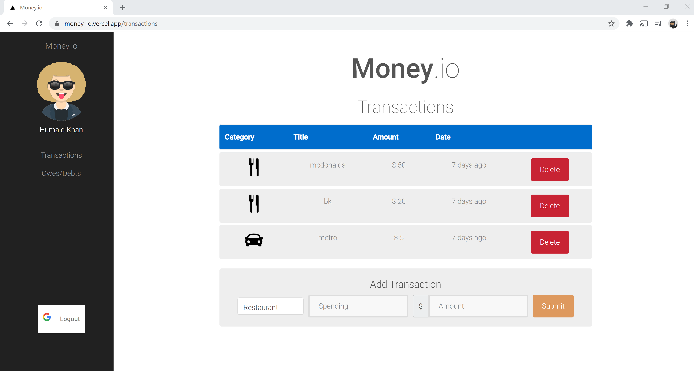

# Money.io

This project is live here [https://money-io.vercel.app](https://money-io.vercel.app/)

Money.io is a financing app that allows users to keep track of their spendings as well as debts and loans.

## Table of Contents

1. [Usage](#Usage)
3. [Development](#development)
   1. [Overview](#Overview)
   2. [Authentication](#Authentication)
   3. [Libraries](#Libraries)
4. [Team](#team)

## Usage

Users can signup using money.io or login with their google accounts for faster access

Once logged in, users can keep track of their spendings from the transactions page

Once logged in, users can keep track of debts due and lowned by adding them from the debts page

## Development

### Overview
Money.io uses a react frontend to build an application that is componentalized.
The application was converted to the new hooks api to reduce codebase by more than 50%
The application was converted to a next js application for faster and free hosting on vercel
Redux was used to manage state, allowing stateful and stateless components to only focus on connected state
Authentication was provided with react-google-login to get the user's access token
An avataar is randomly generated using the username as seed

### Authentication

Authentication is provided using 2 patterns:
1. Using local signup/signin
  1. User signs up by providing their details on the signup page
  2. An email is sent to the user with a token to verify the user
  3. Once the user verifies by clicking the email link, they can login
  4. Upon signin, a redis session is started using passport.js and the user is redirected to transaction
2.  Using google's signin flow [Google signin](https://developers.google.com/identity/sign-in/web/backend-auth)
  1. User logsin with their google details and provides consent
  2. Google returns a token for the user
  3. The token is sent to the backend using the authorization header
  4. Upon token verificationA redis session is started using passport.js and the user is redirected to transaction

### Libraries

Money.IO is built using the following libraries to provide a safe, easy to use
and easy to maintain user experience.
1. [Next.js](http://nextjs.org/) which provides faster loads time using server side rendering
2. [React.js](https://reactjs.org/) which provides a safer, scalable viewing experience
, as well as much shorter code using the new React hooks api
3. [Redux.js](https://redux.js.org/) which stores state in a much more manageable layout
4. [react-google-login](https://github.com/anthonyjgrove/react-google-login) which provides an easy to use login
button based on google's signin recommended practice
4. [Vercel](https://vercel.com/) which provides a free and easy way to host nextjs apps
5. [avataaars](https://github.com/fangpenlin/avataaars) which allows for an easy way to generate avataaars

## Team

- **Product Owner**: Jonathan Wu
- **Scrum Master**: Humaid Khan
- **Development Team Members**: Dunstan Zheng, Chris Lu
